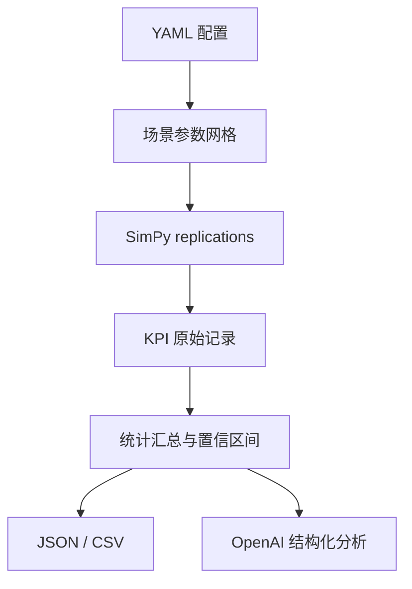

# SimPy KPI Lab

一个可复现、可扩展的离散事件仿真项目：用 SimPy 描述排队系统，用多次 replication 和参数网格做实验，用 KPI 与置信区间比较场景，并可选择调用 OpenAI Responses API 生成结构化分析。

## 能力

- 串行多工位 SimPy 模型；每个工位可配置容量和服务时间分布。
- 指数、定值、均匀、三角分布；固定 seed，可复现实验。
- 到达流与各工位使用独立随机流；默认用共同随机数降低场景差值的方差。
- 多次 replication、参数网格、可选多进程并行。
- KPI：到达量、完成量、吞吐率、期末 WIP、平均/P50/P95 周期时间、平均等待、服务水平、工位利用率、工位平均队长与 P95 等待。
- 每项 KPI 输出均值、样本标准差、正态近似置信区间、最小值和最大值。
- JSON 与 CSV 输出；ChatGPT 分析层输出经过 Pydantic 校验的 JSON 和 Markdown。
- YAML 严格校验、CLI、pytest、ruff、Dockerfile。

## 快速开始

要求 Python 3.11+。

Windows PowerShell：

```powershell
py -3 -m venv .venv
.\.venv\Scripts\python.exe -m pip install -e ".[dev]"

.\.venv\Scripts\simlab.exe validate examples\service_center.yaml
.\.venv\Scripts\simlab.exe run examples\service_center.yaml --workers 4
.\.venv\Scripts\python.exe -m pytest
```

macOS / Linux：

```bash
python -m venv .venv
source .venv/bin/activate
python -m pip install -e ".[dev]"

simlab validate examples/service_center.yaml
simlab run examples/service_center.yaml --workers 4
pytest
```

运行后会生成：

```text
outputs/service_center/
├── results.json       # 配置、每次 replication、汇总结果
├── replications.csv   # 每次实验的宽表 KPI
└── summary.csv        # 每个场景/指标的统计汇总
```

## 接入 ChatGPT / OpenAI API

API key 只通过环境变量读取，不写入 YAML 或结果文件。

Windows PowerShell：

```powershell
$env:OPENAI_API_KEY = "..."
.\.venv\Scripts\simlab.exe run examples\service_center.yaml --analyze
```

macOS / Linux：

```bash
export OPENAI_API_KEY="..."

# 仿真结束后直接分析
simlab run examples/service_center.yaml --analyze

# 或分析已有结果，并提出业务问题
simlab analyze outputs/service_center/results.json \
  --question "比较各容量方案的服务水平、P95 周期时间和利用率，并指出权衡。"
```

输出 `ai_analysis.json` 与 `ai_analysis.md`。项目使用 Responses API 的 `responses.parse(..., text_format=...)`，让模型输出遵循 Pydantic 数据契约。实现依据：[OpenAI 文本生成指南](https://developers.openai.com/api/docs/guides/text) 与 [Structured Outputs 指南](https://developers.openai.com/api/docs/guides/structured-outputs)。

> AI 分析是决策辅助。KPI 数值与置信区间由本地代码计算；模型只能解释提供的数据，不会改写实验结果。

默认 API 配置显式设置 60 秒超时、2 次重试，并使用 `store: false`。这些值可在 YAML 中覆盖；不带 `--analyze` 的仿真完全不需要 API key 或网络。

## 配置说明

最小配置：

```yaml
simulation:
  until: 480
  warmup: 60
  arrival_interarrival: {kind: exponential, mean: 5}
  stations:
    - name: service
      capacity: 2
      service_time: {kind: triangular, low: 4, mode: 8, high: 15}

experiment:
  replications: 20
  base_seed: 20260825
  common_random_numbers: true
  parameter_grid:
    stations.0.capacity: [1, 2, 3]

openai:
  model: gpt-5.6
  max_output_tokens: 2500
  timeout_seconds: 60
  max_retries: 2
  store: false
```

`parameter_grid` 使用相对 `simulation` 的点路径；列表下标也写在路径中。例如：

```yaml
parameter_grid:
  stations.0.capacity: [1, 2]
  arrival_interarrival.mean: [4.0, 5.0, 6.0]
```

会生成 2 × 3 = 6 个场景，每个场景再执行 `replications` 次。也支持以 `simulation.` 开头的完整路径。

`common_random_numbers: true` 会让不同场景的同编号 replication 使用相同 seed，并由基于 BLAKE2b 稳定派生的命名随机流分别驱动到达和各工位服务时间，适合做容量方案的配对比较。工位随机流按名称派生，因此新增或调整其他工位不会意外改变已有工位的随机序列。若场景结构差异很大、不希望随机输入配对，可设为 `false`。

分布格式：

```yaml
# 指数分布
{kind: exponential, mean: 5}

# 定值
{kind: deterministic, value: 5}

# 均匀分布
{kind: uniform, low: 3, high: 7}

# 三角分布
{kind: triangular, low: 3, mode: 5, high: 9}
```

所有时间量使用同一个、由业务自行定义的时间单位；示例使用“分钟”。

## KPI 口径

- 统计窗口为 `[warmup, until)`。
- `arrivals`：统计窗口内的到达数。
- `completed` / `throughput_per_time_unit`：窗口内完成的实体数及其除以窗口长度。
- 周期时间仅统计在 warmup 后到达、且在仿真结束前完成的实体，避免 warmup 前队列污染 cohort 指标。
- 工位等待时间仅统计 warmup 后进入该工位队列、并在结束前开始服务的实体。
- 利用率按统计窗口内实际服务区间 /（capacity × 窗口长度）计算；跨边界的服务区间自动裁剪。
- 平均队长由每个实体的排队时间面积计算，仿真结束时仍在排队的实体也计入。
- `service_level` 为周期时间不超过 `cycle_time_target` 的 cohort 比例。
- `avg_wait_time` 是所有有效工位访问的平均单次等待；`avg_total_wait_time` 是已完成 cohort 每个实体跨工位的平均总等待。
- `censored_cycle_count` 与 `cycle_completion_fraction` 显示仿真结束时的右删失程度，避免只看已完成实体而忽略尾部积压。
- 汇总表按“主要 KPI / 驱动指标 / 护栏 / 数据质量”标注角色、方向和单位；容量、样本数等元数据不会混入 KPI 汇总。
- 置信区间使用 replication 均值的正态近似；`n_total`、`n_missing` 会显式显示缺失值，只有一次有效 replication 时标准差和置信区间为 `null`，不会伪装成零不确定性。replication 较少或重尾数据明显时，建议增加次数或改为 bootstrap / t 区间。

## 如何扩展模型

当前示例是“所有实体依次经过所有工位”的串行网络。常见扩展点：

1. 在 `simulation.py` 的 `customer()` 中加入条件路由、返工、优先级或批处理。
2. 在 `config.py` 中新增业务参数，保持 `extra="forbid"` 以尽早发现拼写错误。
3. 在 `KPICollector` 中通过事件记录新增 KPI；不要让 AI 参与 KPI 数值计算。
4. 为新增的随机过程延续“独立随机流”规则，避免改变某个工位后意外改变到达序列。
5. 为定制模型增加一个新的 runner，而不是把业务规则硬编码进 CLI。

## 设计结构



OpenAI 层是可选适配器；没有 API key 时，仿真、KPI 与导出功能仍可完整运行。

## Docker

```bash
docker build -t simpy-kpi-lab .
docker run --rm -v "$PWD/outputs:/app/outputs" simpy-kpi-lab
```

如需 API 分析：

```bash
docker run --rm \
  -e OPENAI_API_KEY \
  -v "$PWD/outputs:/app/outputs" \
  simpy-kpi-lab run examples/service_center.yaml --analyze
```
